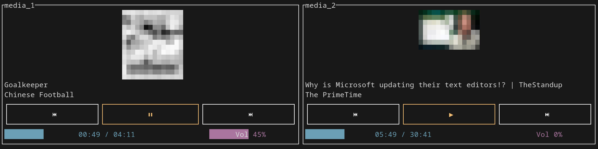
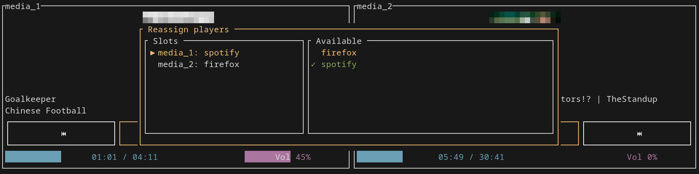
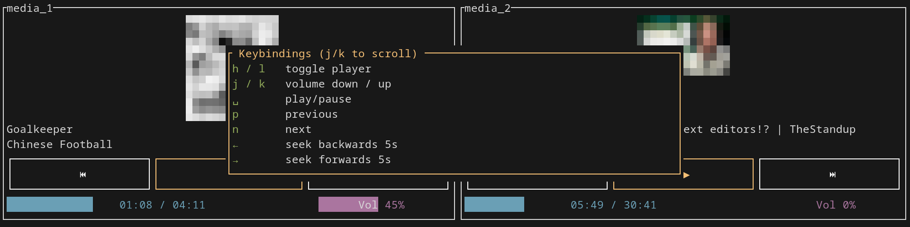

# media player TUI

Just a quick personal project for a tiny 7" touchscreen that I have lying around. Trying to make a media player with ratatui that can be controlled with touch input and keyboard shortcuts.

## settings

## help

